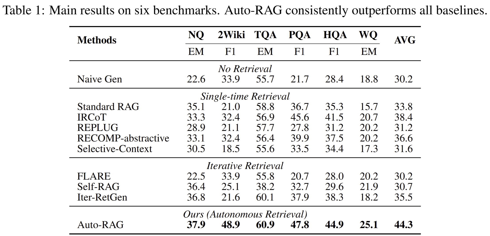

# Auto-RAG: Autonomous Retrieval-Augmented Generation for Large Language models

> [Tian Yu](https://tianyu0313.github.io/), [Shaolei Zhang](https://zhangshaolei1998.github.io/), [Yang Feng](https://people.ucas.edu.cn/~yangfeng?language=en)*

[](https://arxiv.org/abs/2411.19443)
[](https://github.com/ictnlp/Auto-RAG)
[](https://huggingface.co/ICTNLP/Auto-RAG)

Source code for paper "[Auto-RAG: Autonomous Retrieval-Augmented Generation for Large Language models](https://arxiv.org/abs/2411.19443)".

If you find this project useful, feel free to ⭐️ it and give it a [citation](#citation)!


## Overview

**Auto-RAG** is an autonomous iterative retrieval model centered on the LLM's powerful decision-making capabilities. Auto-RAG models the interaction between the LLM and the retriever through multi-turn dialogue, employs iterative reasoning to determine when and what to retrieve, ceasing the iteration when sufficient external knowledge is available, and subsequently providing the answer to the user.

- **GUI interaction**: We provide a deployable user interaction interface. After inputting a question, Auto-RAG autonomously engages in interaction with the retriever without any human intervention. Users have the option to decide whether to display the details of the interaction between Auto-RAG and the retriever.

<div  align="center">   
  
</div>


- To interact with Auto-RAG in your browser, follow the guide for [GUI interaction](#gui-interaction).


## Models Download

We provide trained Auto-RAG models using the synthetic data. Please refer to https://huggingface.co/ICTNLP/Auto-RAG-Llama-3-8B-Instruct.

## Installation
- Environment requirements: Python 3.12, [FlexRAG](https://github.com/ictnlp/flexrag).

```bash
conda env create autorag python=3.12

pip install flexrag
```

- Clone Auto-RAG's repo.

```bash
git clone https://github.com/ictnlp/Auto-RAG.git
cd Auto-RAG
```

- Download corpus and prepare the retriever

We use the wiki corpus provided by [DPR](https://github.com/facebookresearch/DPR) project. You can prepare the dense retriever by runing the following command:

```bash
bash scripts/prepare_retriever.sh
```


## Model deployment

We use vLLM to deploy the model for inference. You can update the parameters in vllm.sh to adjust the GPU and model path configuration, then execute:

```bash
bash scripts/deploy.sh
```


## GUI Interaction

To interact with Auto-RAG in your browser, run the following command:

```bash
bash scripts/run_gui.sh
```

> [!Tip]
> The interaction process between Auto-RAG and the retriever can be optionally displayed by adjusting a toggle.

## Run as a FlexRAG Assistant
You can also run Auto-RAG as a FlexRAG assistant. To do this, execute the following command:

```bash
ENCODER_PATH='intfloat/e5-base-v2'
MODEL_NAME="<name of your deployed vllm model>"
BASE_URL="<your model url>"
DATA_PATH="<path to the test data>"


python -m flexrag.entrypoints.run_assistant \
    user_module="<Auto-RAG path>" \
    data_path=$DATA_PATH \
    assistant_type=autorag \
    autorag_config.model_name=$MODEL_NAME \
    autorag_config.base_url=$BASE_URL \
    autorag_config.database_path=wiki \
    autorag_config.index_type=faiss \
    autorag_config.query_encoder_config.encoder_type=hf \
    autorag_config.query_encoder_config.hf_config.model_path=$ENCODER_PATH \
    eval_config.metrics_type=[retrieval_success_rate,generation_f1,generation_em] \
    eval_config.retrieval_success_rate_config.eval_field=text \
    eval_config.response_preprocess.processor_type=[simplify_answer] \
    log_interval=10
```

## Experimental Results
> [!Note]
> Experimental results show that Auto-RAG outperforms all baselines across six benchmarks.

<div  align="center">   
  
</div>
<p align="center">

</p>


## Licence
This project is licensed under the Apache License, Version 2.0. See [LICENSE](LICENSE) for the full license text.

## Citation

If this repository is useful for you, please cite as:

```
@article{yu2024autorag,
      title={Auto-RAG: Autonomous Retrieval-Augmented Generation for Large Language Models}, 
      author={Tian Yu and Shaolei Zhang and Yang Feng},
      year={2024},
      eprint={2411.19443},
      archivePrefix={arXiv},
      primaryClass={cs.CL},
      url={https://arxiv.org/abs/2411.19443}, 
}
```

If you have any questions, feel free to contact `yutian23s@ict.ac.cn`.
